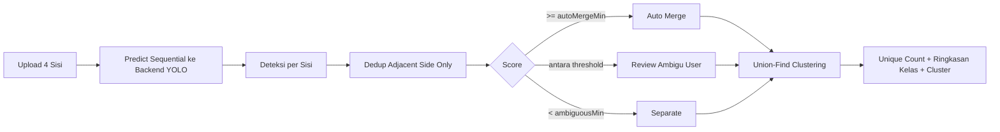

# SawitAI

Frontend app untuk deteksi tandan sawit dari endpoint Ultralytics (YOLO) dengan dua mode counting:
- `Deteksi File Tunggal` (gambar/video),
- `Hitung 1 Pohon (4 Foto)` untuk deduplikasi lintas sisi (Depan, Kanan, Belakang, Kiri).

## Dokumentasi

- [Arsitektur dan flow lengkap](docs/architecture.md)
- [Panduan tuning akurasi counting](docs/tuning-guide.md)

## Update Terbaru

- Mode 4 sisi sekarang menampilkan `Ringkasan Kelas` (bukan hanya ringkasan per sisi).
- Tabel `Cluster Tandan Unik` sekarang menampilkan `kelas dominan` per cluster.
- Warna kelas diselaraskan antar mode 4 sisi dan mode video agar tidak membingungkan user.
- Review ambigu menggunakan full-frame (bukan crop) agar keputusan manusia lebih kontekstual.
- Dedup 4 sisi tetap memakai kebijakan `adjacent-side only` untuk menekan false match ekstrem.

## Ringkasan Flow 4 Sisi



## Standard Output (User-Facing)

Mode 4 sisi:
- `Tandan Unik`
- `Deteksi Mentah`
- `Merge Deduplikasi`
- `Ringkasan Kelas` (`kelas`, `tandan unik`, `deteksi mentah`, `avg confidence`)
- `Cluster Tandan Unik` (`cluster`, `kelas`, `jumlah anggota`, `sisi terlibat`, `avg confidence`)

Mode video:
- `Tandan Unik` (berdasarkan tracking)
- `Frame Diproses`
- `Avg Confidence`
- tabel deteksi frame dengan `kelas` + warna konsisten

## Menjalankan Lokal

```powershell
cd C:\Users\Zainal\Desktop\App-Sawit
C:\Python314\python.exe -m http.server 5500
```

Buka `http://localhost:5500`.
