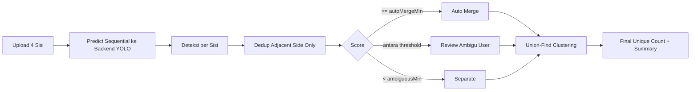

# SawitAI

Frontend app untuk inferensi deteksi tandan sawit + counting unik lintas 4 foto (1 pohon, 4 sisi).

## Dokumentasi

- Arsitektur dan flow lengkap: `docs/architecture.md`
- Panduan tuning akurasi counting: `docs/tuning-guide.md`

## Ringkasan Alur



## Menjalankan Lokal

```powershell
cd C:\Users\Zainal\Desktop\App-Sawit
C:\Python314\python.exe -m http.server 5500
```

Buka `http://localhost:5500`.
