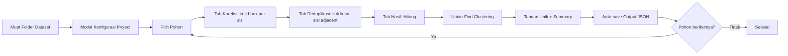

# SawitAI — Arsitektur & Alur End-to-End

## 1) Gambaran Umum

**SawitAI** adalah aplikasi single-page **offline** untuk koreksi anotasi dataset YOLO tandan buah sawit (TBS) dan deduplikasi tandan lintas sisi pohon. Tidak ada backend, tidak ada inferensi model di app, tidak ada build step — semua berjalan di browser dari folder dataset lokal.

**Asumsi input:** Dataset sudah memiliki label `.txt` YOLO awal (mis. dari hasil inferensi sebelumnya). App ini hanya untuk **koreksi manusia**, **deduplikasi lintas sisi**, dan **ekspor JSON** sesuai spesifikasi.

**Output utama:** Satu file JSON per pohon dengan tree ID terstandarisasi, daftar anotasi per sisi (koordinat YOLO + pixel), dan daftar tandan unik hasil clustering.

---

## 2) Komponen Utama

| File | Peran |
|---|---|
| `index.html` | Layout 3-tab (Koreksi · Deduplikasi · Hasil), modal konfigurasi project, toast |
| `css/style.css` | Layout, theming, komponen editor & dedup canvas |
| `js/yolo-io.js` | Parser & serializer label YOLO; `CLASS_MAP` (B1–B4) |
| `js/canvas.js` | `CanvasRenderer` — render gambar + bbox dengan warna kelas |
| `js/dedup-utils.js` | Union-Find + scoring geometri lintas sisi (`suggestPairs`) |
| `js/session.js` | `ActiveSession` — state pohon aktif, links, serialisasi sesi |
| `js/dataset.js` | `DatasetManager` — load folder via `webkitdirectory`, susun tree |
| `js/bbox-editor.js` | `BBoxEditor` — editor interaktif (draw / move / resize / delete) |
| `js/dedup-ui.js` | `DedupUI` — dua kanvas berdampingan untuk linking lintas sisi |
| `js/results.js` | `Results` — counting unik, ringkasan kelas, ekspor (JSON/CSV/YOLO/Identity) |
| `js/project.js` | `ProjectConfig` — konfigurasi project, generator tree ID, registry pohon tersimpan |
| `js/output-schema.js` | `OutputSchema` — generate JSON output spec Bu-Fatma per pohon |
| `js/fs-output.js` | `FsOutput` — wrapper File System Access API + fallback download |
| `js/app.js` | Orkestrator — tab switching, event wiring, modal konfigurasi, auto-save |

---

## 3) Alur End-to-End

```
1. User klik "Muat Folder"
   → DatasetManager: scan via webkitdirectory
   → Susun pohon dari nama file (STEM_N.jpg + STEM_N.txt)
   → Tampilkan modal Konfigurasi Project

2. User isi tanggal + varietas + pilih folder output
   → ProjectConfig: simpan ke memori (per-session)
   → Auto-detect varietas dari nama file pertama
   → Preview tree ID pertama: YYYYMMDD-VARIETAS-001

3. User mulai per-pohon: pilih dari dropdown atau navigasi [ / ]
   → ActiveSession.loadTree(): parse semua label sisi
   → Bbox di-assign ID stabil "b" + boxIndex

4. Tab Koreksi Anotasi
   → Pilih sisi (Q/E untuk navigasi)
   → Edit bbox: draw / drag-move / resize / change class (1–4) / delete
   → Magnifier opsional (M)

5. Tab Deduplikasi
   → Pilih pasangan adjacent (← / →)
   → Tombol "Jalankan Saran" (R) → suggestPairs() menghasilkan saran
   → Klik bbox kiri → klik bbox kanan → tautkan
   → Edit/hapus bbox langsung dari kanvas dedup juga didukung

6. Tab Hasil
   → "Hitung" → Results.compute() → union-find clustering
   → Tampilkan total unik, breakdown kelas, daftar cluster
   → Auto-save output JSON ke folder yang dipilih
   → Ekspor manual: JSON / CSV / YOLO labels / Identity

7. Pindah pohon → auto-save dijalankan untuk pohon sebelumnya
   → ProjectConfig menandai pohon sebagai "saved"
   → Counter di header memperlihatkan progress
```

---

## 4) Data Model

### Sesi Pohon (ActiveSession)

```js
{
  treeName: "DAMIMAS_A21B_0003",
  split: "train",
  sides: [
    {
      sideIndex: 0,             // 0..N-1; label UI selalu "Sisi (sideIndex+1)"
      label: "Sisi 1",
      imageWidth, imageHeight,
      bboxes: [
        { id: "b0", classId: 1, className: "B1",
          x1, y1, x2, y2 }      // pixel coords
      ]
    },
    ...
  ],
  suggestedLinks: [],           // hasil suggestPairs (tidak di-persist)
  confirmedLinks: [
    { linkId, sideA, bboxIdA, sideB, bboxIdB }
  ]
}
```

### Output JSON (per pohon)

Lihat `js/output-schema.js`. Struktur ringkas:

```js
{
  version: 1,
  tree_id: "20260416-DAMIMAS-001",
  tree_name: "DAMIMAS_A21B_0003",
  split: "train",
  metadata: { date, varietas, number, generated_at },
  images: {
    sisi_1: { filename, label_file, side_index: 0, width, height, bbox_count, annotations: [...] },
    sisi_2: { ... },
    sisi_3: { ... },
    sisi_4: { ... }
    // ...sisi_N untuk dataset N-sisi
  },
  bunches: [
    {
      bunch_id: 1,
      class: "B2",                  // majority-vote
      class_mismatch: false,
      appearance_count: 2,
      appearances: [
        { side: "sisi_1", side_index: 0, box_index: 3, class_name: "B2", bbox_pixel: [x1,y1,x2,y2] },
        { side: "sisi_2", side_index: 1, box_index: 0, ... }
      ]
    }
  ],
  summary: {
    total_unique_bunches, total_detections, duplicates_linked,
    by_class: { B1: n, B2: n, ... },
    by_side:  { sisi_1: n, sisi_2: n, ... }
  }
}
```

Tiap anotasi membawa **dua** bentuk koordinat — `bbox_yolo` (normalized cx,cy,w,h) dan `bbox_pixel` (xyxy). JSON ini self-contained: konsumen hilir tidak perlu file label asli.

---

## 5) Deduplikasi Lintas-Sisi

### Pasangan yang Dibandingkan

Hanya sisi **bersebelahan** dalam urutan putaran (mis. untuk 4 sisi):

```
Sisi 1 ↔ Sisi 2
Sisi 2 ↔ Sisi 3
Sisi 3 ↔ Sisi 4
Sisi 4 ↔ Sisi 1
```

Sisi berlawanan (Sisi 1↔Sisi 3, Sisi 2↔Sisi 4 pada dataset 4 sisi) tidak dibandingkan — perspektifnya terlalu berbeda sehingga objek yang sama nyaris tidak mungkin match secara reliabel. Untuk dataset N-sisi, `ADJACENT_PAIRS` di-generate otomatis.

### Skor Pasangan (`suggestPairs` di `dedup-utils.js`)

Algoritma menerapkan dua hard gate sebelum scoring, kemudian mutual best pairing setelah scoring.

**Hard gate 1 — seam band:** Hanya bbox yang pusatnya berada pada separuh gambar dekat garis seam antar dua sisi yang dipertimbangkan (`seamBandFraction = 0.50` default). Bbox di separuh jauh tidak mungkin juga tertangkap di gambar sebelahnya.

**Hard gate 2 — size ratio:** Pair dibuang jika `min(areaA,areaB)/max(areaA,areaB) < sizeRatioMin` (default `0.30`).

**Skoring:**

```
score = (0.45 × seam + 0.35 × vert + 0.20 × size) × classMult
```

| Sinyal | Penjelasan |
|---|---|
| **seam** | Rata-rata dua seam-proximity kontinu (tiap sisi: 1 di tepi, 0 di batas band). |
| **vert** | Kemiripan posisi Y centroid (gravitasi → tandan tetap di tinggi yang sama). |
| **size** | Gabungan kemiripan area (60%) + aspect ratio (40%). |
| **classMult** | Pengali: 1.0 jika class sama, 0.85 jika ±1 grade, 0.5 jika jauh. Class bukan sinyal aditif. |

### Kategorisasi & Mutual Best Pair

```
score ≥ autoMin   (default 0.75)  → category: "auto"        (saran kuat)
score ≥ candMin   (default 0.50)  → category: "candidate"   (saran lemah)
score <  candMin                  → buang
```

Pair `(A, B)` hanya dipertahankan jika `A` paling cocok dengan `B` **dan** `B` paling cocok dengan `A` (`mutualBest = true`). Mencegah satu bbox memonopoli kandidat seperti greedy assignment versi lama.

Detail lengkap dan roadmap (Tahap 1–4) di [README.md](../README.md#algoritma-saran-tahap-1--2-aktif). Panduan tuning parameter di [tuning-guide.md](tuning-guide.md).

### Final Aggregation

Saat tab Hasil ditekan **Hitung**:

1. Semua `confirmedLinks` di-feed ke Union-Find.
2. Bbox yang terhubung (langsung atau transitif) menjadi satu cluster = satu tandan unik.
3. Bbox tanpa link tetap menjadi cluster sendiri.
4. Class per cluster ditentukan via majority vote; mismatch ditandai.

---

## 6) Persistensi

- **Memori per session** (hilang saat refresh): `ProjectConfig` (tanggal, varietas, output dir handle, daftar pohon tersimpan + handle file output-nya).
- **Tidak ada `localStorage`** dipakai secara default.
- **Persistensi keluar dari app:** file JSON output di folder yang user pilih (via File System Access API atau download manual).
- **Resume:** muat ulang folder dataset → app cek folder output → tandai pohon yang sudah punya file JSON. Atau klik **Muat Sesi** untuk memuat satu pohon dari file JSON yang sudah ada (`OutputSchema.toSessionJSON` mengubah output JSON kembali ke shape sesi).

---

## 7) Penyimpanan File (`fs-output.js`)

`FsOutput.saveJSON(filename, data)`:

1. Coba tulis ke `outputDirHandle` (File System Access API). Filename pola: `{tree_id}__{tree_name}.json`.
2. Jika tidak tersedia / permission ditolak → fallback ke browser download.
3. Mengembalikan `{ ok, method: "filesystem" | "download" }`.

`FsOutput.listOutputFiles()`: scan folder output, kembalikan map `tree_name → FileSystemFileHandle` untuk pohon yang sudah pernah disimpan.

---

## 8) Diagram Alur



---

## 9) Batasan Saat Ini

- Inferensi YOLO **tidak** dilakukan di app — label awal harus sudah ada di folder dataset.
- Deduplikasi murni geometris (edge / vertical / class / size). Tidak menggunakan fitur visual (perceptual hash, histogram warna, embedding).
- Hanya pasangan **adjacent** sisi yang di-score; objek yang hanya muncul di dua sisi berlawanan tidak akan dikenali sebagai duplikat.
- Konfigurasi project tidak persisten antar refresh browser — user perlu mengisi ulang tanggal/varietas/folder output di awal sesi (folder output via File System Access API juga harus dipilih ulang karena handle tidak boleh disimpan).
- Greedy 1-to-1 assignment: per pasangan sisi, satu bbox hanya bisa berpasangan dengan satu lawan terbaik.
