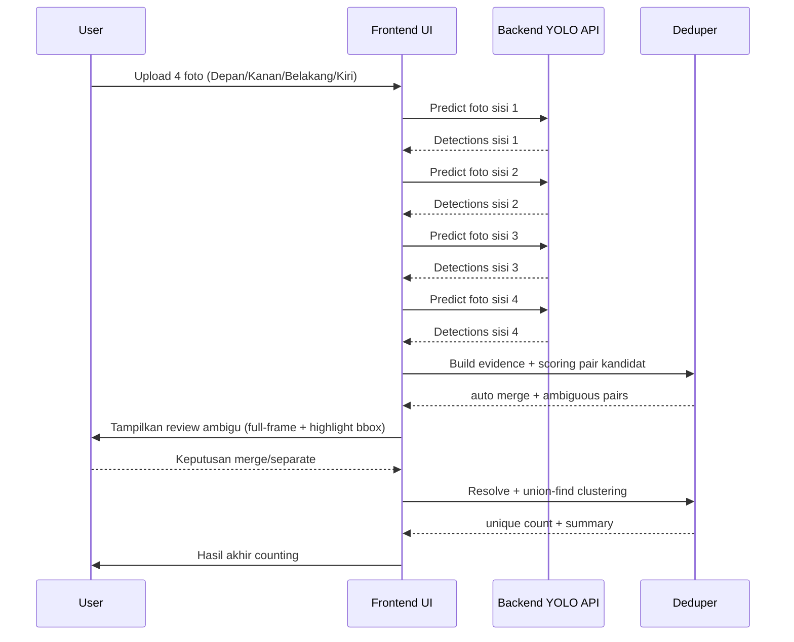

# SawitAI Architecture (Accurate Counting 4 Sisi)

## 1) Tujuan

Backend YOLO hanya melakukan inferensi per gambar (deteksi + klasifikasi + confidence).  
Frontend menambahkan logika produk agar hasil menjadi **counting unik** lintas 4 sisi pohon (anti-overcount).

## 2) Tanggung Jawab Backend vs Frontend

### Backend (Ultralytics Endpoint)
- menerima 1 file gambar per request,
- mengembalikan deteksi objek.

### Frontend (App)
- wizard input 4 sisi (Depan, Kanan, Belakang, Kiri),
- inferensi batch sequential ke backend,
- deduplikasi lintas sisi,
- review ambigu oleh user,
- agregasi cluster objek unik dan summary final.

## 3) Komponen Utama

- `index.html`
  - mode switch (`single` vs `4 sisi`), panel review ambigu, panel hasil.
- `css/style.css`
  - layout, responsive, animasi, komponen review.
- `js/api.js`
  - API call inferensi + `predictBatchSequential`.
- `js/session.js`
  - state session counting per pohon.
- `js/deduper.js`
  - candidate generation, scoring, thresholding, final clustering.
- `js/tree-mode.js`
  - orchestration UI flow mode 4 sisi.
- `js/app.js`
  - pengaturan global + persistence konfigurasi.

## 4) Data Flow End-to-End

## 5) Dedup Policy (Kunci Akurasi)

### Adjacent-side only pairing

Pair yang dibandingkan hanya:
- Depan <-> Kanan
- Kanan <-> Belakang
- Belakang <-> Kiri
- Kiri <-> Depan

Tidak dibandingkan langsung:
- Depan <-> Belakang
- Kanan <-> Kiri

Ini mengurangi false match dari perbedaan perspektif ekstrem.

### Fitur scoring

Skor pasangan kandidat menggunakan kombinasi:
- dHash similarity,
- HSV histogram similarity,
- geometry similarity (area + aspect),
- edge prior (posisi relatif terhadap tepi frame).

### Keputusan threshold

- `score >= autoMergeMin` -> auto merge
- `ambiguousMin <= score < autoMergeMin` -> masuk review user
- `score < ambiguousMin` -> separate

## 6) Review Ambigu (Human-in-the-loop)

Review ambigu menggunakan:
- full-frame sisi A dan sisi B,
- semua bbox ditampilkan redup,
- bbox kandidat ambigu di-highlight,
- keputusan user: `Sama Tandan` atau `Berbeda`.

Catatan: pendekatan ini dipilih karena manusia butuh konteks lebar frame, bukan crop dekat.

## 7) Final Aggregation

Setelah keputusan merge:
- semua pasangan merge dimasukkan ke union-find,
- objek yang terhubung menjadi 1 cluster unik,
- output:
  - total deteksi mentah,
  - total cluster unik,
  - jumlah merge,
  - ringkasan per sisi,
  - detail cluster.

## 8) Konfigurasi Persisten

Disimpan di `localStorage`:
- inferensi model (`conf`, `iou`, `imgsz`)
- tracker video
- dedup 4 sisi (`sawitai_tree_count`):
  - `autoMergeMin`
  - `ambiguousMin`

## 9) Batasan Saat Ini

- identity matching masih heuristik (belum ReID model khusus),
- kualitas capture sangat mempengaruhi akurasi,
- belum ada global multi-view optimization (masih pairwise + union).
