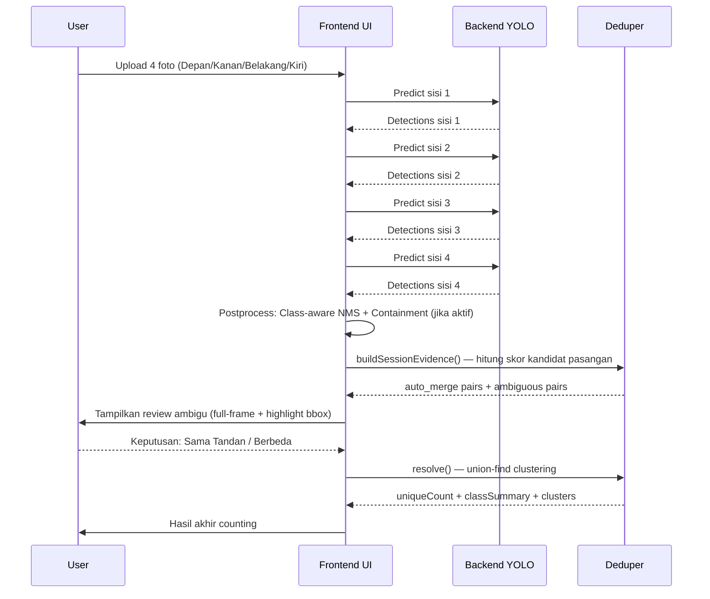
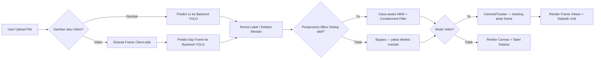

# SawitAI — Arsitektur & Alur End-to-End

## 1) Gambaran Umum

**SawitAI** adalah aplikasi web client-side untuk mendeteksi dan menghitung tandan buah sawit (TBS) menggunakan model YOLO via endpoint Ultralytics. Tidak ada backend milik sendiri — semua kalkulasi, deduplikasi, dan logika akurasi dijalankan sepenuhnya di browser.

**Prinsip utama:** Backend YOLO hanya bertugas mendeteksi objek per gambar. Seluruh logika agar hasil menjadi *counting unik* yang akurat (anti-overcount) adalah tanggung jawab frontend.

---

## 2) Tanggung Jawab Backend vs Frontend

### Backend (Ultralytics Endpoint)

- Menerima 1 file gambar per request.
- Menjalankan inferensi YOLO (deteksi + klasifikasi + confidence).
- Mengembalikan daftar bounding box dengan label kelas dan skor kepercayaan.
- **Tidak tahu** apakah gambar berasal dari sisi pohon yang sama atau berbeda.

### Frontend (App)

- Menyediakan wizard input untuk 2 mode (file tunggal atau 4 sisi pohon).
- Mengirim request inferensi ke backend secara sequential.
- **Menjalankan 3 lapisan deduplikasi** pasca-inferensi untuk memastikan counting unik.
- Menyediakan review manual untuk kasus ambigu.
- Menghasilkan agregasi cluster objek unik, kelas dominan, dan summary akhir.

---

## 3) Komponen Utama

| File | Peran |
|---|---|
| `index.html` | Layout UI: mode switch, panel review ambigu, panel hasil |
| `css/style.css` | Layout, responsive, animasi, komponen review |
| `js/api.js` | API client: single predict + batch sequential predict |
| `js/app.js` | Pengaturan global, persistence konfigurasi ke localStorage |
| `js/session.js` | State management session counting per pohon (4 sisi) |
| `js/tree-mode.js` | Orchestration UI flow mode 4 sisi |
| `js/deduper.js` | Kandidat pasangan, scoring, thresholding, union-find clustering |
| `js/postprocess.js` | Deduplikasi bounding box pasca-inferensi (semua mode) |
| `js/tracker.js` | CentroidTracker: tracking objek antar frame (mode video) |
| `js/canvas.js` | Render canvas: gambar + bounding box + label |

---

## 4) Penerimaan Label dari Endpoint

### Format Request

```
POST /predict
Authorization: Bearer <API_KEY>
Content-Type: multipart/form-data

file:   <image blob>
conf:   0.25   (confidence threshold)
iou:    0.45   (NMS IoU threshold)
imgsz:  640    (ukuran input gambar)
```

### Format Response (Ditangani Fleksibel)

App mendukung beberapa variasi format respons YOLO:

```javascript
// Format 1: Ultralytics standard
{ images: [{ results: [...] }] }

// Format 2: Nested results
{ results: [...] }

// Format 3: Direct array
[...]

// Format 4: Data wrapper
{ data: { images: [{ results: [...] }] } }
```

### Struktur Tiap Deteksi

```javascript
{
  name: "B2",           // nama kelas (dipakai sebagai label)
  class: 1,             // nomor kelas (opsional)
  confidence: 0.92,     // skor kepercayaan
  box: {                // koordinat bounding box
    x1: 100, y1: 200,
    x2: 300, y2: 400
  }
}
```

Parser mendukung alternatif field: `conf` selain `confidence`, dan `bbox`/`xyxy` selain `box`.

---

## 5) Alur End-to-End

### 5A. Mode File Tunggal (Gambar)

```
Upload Gambar
  → api.js: POST /predict (1x)
  → Terima label (bounding box + kelas + confidence)
  → [Postprocess] Class-aware NMS + Containment Filter
  → canvas.js: Render gambar + bounding box
  → Tabel deteksi (kelas, confidence)
```

### 5B. Mode File Tunggal (Video)

```
Upload Video
  → Ekstrak frame client-side (browser, tidak perlu server)
  → Loop tiap frame:
      → api.js: POST /predict
      → Terima label per frame
      → [Postprocess] Class-aware NMS + Containment Filter
      → tracker.js: CentroidTracker.update(detections)
          → BYTE-style two-stage matching
          → Kompensasi gerak kamera
          → Assign trackId konsisten
  → Hitung objek unik: yang muncul ≥ minHits frame
  → Render frame viewer + statistik tracking
```

### 5C. Mode 4 Sisi (Tree Mode)

```
Upload 4 Foto (Depan / Kanan / Belakang / Kiri)
  → api.js: predictBatchSequential (4 request, sequential)
      → Tiap sisi: POST /predict → Terima label
      → [Postprocess] Class-aware NMS + Containment Filter per sisi
      → Simpan deteksi per sisi ke TreeSessionStore
  → deduper.js: buildSessionEvidence()
      → Tiap deteksi: hitung crop features
          → dHash (perceptual hash)
          → HSV histogram
          → Geometry (area + aspect ratio)
          → Edge proximity
      → Bentuk kandidat pasangan ADJACENT ONLY
          → Depan ↔ Kanan, Kanan ↔ Belakang
          → Belakang ↔ Kiri, Kiri ↔ Depan
          → (Depan ↔ Belakang dan Kanan ↔ Kiri TIDAK dibandingkan)
      → Hitung skor tiap pasangan
      → Kategorikan: auto_merge / ambiguous / separate
  → Tampilkan review ambigu (full-frame + highlight bbox)
      → User memutuskan: "Sama Tandan" atau "Berbeda"
  → deduper.js: resolve()
      → Union-Find: gabungkan semua pasangan yang di-merge
      → Hitung cluster unik
  → Tampilkan hasil:
      → Tandan Unik, Deteksi Mentah, Merge Deduplikasi
      → Ringkasan Kelas, Cluster Tandan Unik
```

---

## 6) Diagram Alur

### Mode 4 Sisi



### Mode File Tunggal



---

## 7) Tiga Lapisan Akurasi Pasca-Inferensi

Ini adalah inti dari cara app memastikan hasil counting akurat setelah menerima label dari endpoint.

---

### Lapisan 1 — Post-Inference Bounding Box Deduplication
**File:** `postprocess.js` | **Berlaku:** Semua mode (gambar, video, 4 sisi)

**Tujuan:** Menghapus bounding box duplikat atau tumpang-tindih yang dihasilkan model dalam satu gambar, sebelum diteruskan ke proses berikutnya.

**Masalah yang diselesaikan:** Model YOLO terkadang menghasilkan beberapa box untuk objek yang sama, terutama pada objek yang besar, terhalang sebagian, atau mendekati batas kelas. Tanpa filter ini, satu tandan bisa terhitung 2–3x dari satu gambar.

**Algoritma:**
1. Urutkan semua deteksi berdasarkan confidence (tertinggi dahulu).
2. Iterasi tiap deteksi; bandingkan dengan deteksi yang sudah diterima:
   - **IoU check:** Jika `IoU ≥ threshold` → box dianggap duplikat → hapus.
   - **Containment check:** Jika satu box berada di dalam box lain dengan rasio `≥ threshold` → hapus yang lebih kecil.
   - **Class-aware relaxation:** Dua box dengan kelas berbeda menggunakan threshold lebih longgar (`iou + 0.22`), karena objek berbeda kelas yang berdekatan lebih mungkin benar-benar berbeda.
3. Pertahankan hanya box yang lolos kedua pemeriksaan.

**Parameter:**
| Parameter | Default | Keterangan |
|---|---|---|
| `Post NMS IoU` | 0.45 | Ambang IoU untuk dianggap duplikat |
| `Containment Threshold` | 0.82 | Ambang rasio containment |
| `enabled` | true | Aktif/nonaktif fitur ini |

---

### Lapisan 2 — Video Centroid Tracking
**File:** `tracker.js` | **Berlaku:** Mode video saja

**Tujuan:** Mencegah tandan yang sama dihitung ulang di setiap frame video. Satu tandan yang terlihat di 30 frame tetap dihitung sebagai 1 objek unik.

**Masalah yang diselesaikan:** Tanpa tracking, satu tandan yang terlihat di N frame akan menghasilkan N deteksi — overcount masif pada video.

**Algoritma (BYTE-style, dua tahap):**

*Tahap 1 — High-confidence matching:*
- Ambil deteksi dengan confidence ≥ `trackConf` (default 0.35).
- Cocokkan ke track yang sudah ada berdasarkan jarak centroid.
- Estimasi gerak kamera (pan/tilt) dari pasangan yang berhasil di-match.

*Tahap 2 — Low-confidence matching:*
- Deteksi low-confidence yang belum ter-assign dicoba cocokkan ke track yang tidak ter-match di tahap 1.
- Posisi track dikoreksi dengan estimasi gerak kamera dari tahap 1.

*Manajemen track:*
- Track baru dibuat jika tidak ada pasangan yang cocok.
- Track yang tidak ter-update selama `maxAge` frame dihapus.
- Objek dihitung unik hanya jika track-nya muncul di ≥ `minHits` frame.

**Parameter:**
| Parameter | Default | Keterangan |
|---|---|---|
| `trackConf` | 0.35 | Confidence minimum untuk diterima tracker |
| `maxDistPct` | 8% | Jarak centroid maksimal (% dari diagonal frame) |
| `maxAge` | 4 | Frame maksimal track tanpa update sebelum dihapus |
| `minHits` | 2 | Minimal kemunculan sebelum dihitung unik |
| `nmsIou` | 0.50 | NMS internal tracker |

---

### Lapisan 3 — Cross-View Deduplication (4-Sisi)
**File:** `deduper.js` | **Berlaku:** Mode 4 sisi saja

**Tujuan:** Mencegah tandan yang sama — yang terlihat dari dua sudut berbeda — dihitung dua kali. Ini adalah lapisan paling kompleks karena harus mencocokkan objek yang secara visual berbeda akibat perubahan perspektif, pencahayaan, dan jarak.

**Masalah yang diselesaikan:** Satu tandan di pojok pohon bisa terlihat di foto Depan dan foto Kanan. Tanpa deduplikasi lintas sisi, tandan tersebut dihitung 2x.

#### A. Ekstraksi Fitur Crop

Untuk setiap bounding box di tiap sisi, dihitung 4 fitur visual:

| Fitur | Bobot | Cara Hitung | Mengapa Berguna |
|---|---|---|---|
| **dHash** (Perceptual Hash) | 45% | Gambar crop di-resize ke 9×8 grayscale, hitung Hamming distance antar bit | Robust terhadap perubahan skala dan pencahayaan ringan |
| **HSV Histogram** | 25% | Histogram 12-bin pada ruang warna HSV, ukur intersection | Menangkap warna dan tingkat kematangan buah |
| **Geometry** | 20% | Kemiripan area dan aspect ratio bounding box | Memperhitungkan distorsi perspektif antar sisi |
| **Edge Proximity** | 10% | Seberapa dekat objek ke tepi frame | Objek di tepi frame lebih mungkin muncul di sisi lain |

#### B. Pembentukan Pasangan Kandidat

Hanya sisi **bersebelahan** yang dibandingkan:

```
Depan ↔ Kanan      (rotasi 90°)
Kanan ↔ Belakang   (rotasi 90°)
Belakang ↔ Kiri    (rotasi 90°)
Kiri ↔ Depan       (rotasi 90°)
```

**Tidak dibandingkan:**
```
Depan ↔ Belakang   (rotasi 180° — perspektif terlalu berbeda)
Kanan ↔ Kiri       (rotasi 180° — perspektif terlalu berbeda)
```

Alasan: Sisi berlawanan memiliki perbedaan perspektif ekstrem sehingga objek yang sama akan terlihat sangat berbeda, meningkatkan risiko false negative (tidak terdeteksi sebagai sama) dan false positive (objek berbeda terdeteksi sebagai sama).

#### C. Formula Skor

```
baseScore  = (0.45 × dHash) + (0.25 × HSV) + (0.20 × geometry) + (0.10 × edgePrior)
finalScore = baseScore × classPenalty

classPenalty:
  - kelas sama  → ×1.0 (tidak ada penalti)
  - kelas beda  → ×0.9 (penalti 10%)
```

#### D. Kategorisasi Keputusan

| Skor | Kategori | Tindakan |
|---|---|---|
| `≥ autoMergeMin` (default 0.82) | `auto_merge` | Langsung digabung — dianggap pasti tandan yang sama |
| `ambiguousMin ≤ score < autoMergeMin` (0.68–0.82) | `ambiguous` | Masuk antrian review manual oleh user |
| `< ambiguousMin` (default 0.68) | `separate` | Diabaikan — dianggap tandan berbeda |

#### E. Review Ambigu (Human-in-the-Loop)

Untuk setiap pasangan ambigu, user disajikan:
- **Full-frame** foto sisi A dan sisi B (bukan crop kecil).
- Semua bounding box di kedua gambar ditampilkan redup.
- Bounding box kandidat pasangan di-highlight di kedua gambar.
- Tombol keputusan: **"Sama Tandan"** (merge) atau **"Berbeda"** (separate).

Pendekatan full-frame dipilih karena manusia butuh konteks sekitar objek untuk membuat keputusan yang akurat — crop kecil tanpa konteks mudah menyesatkan.

#### F. Final Aggregation (Union-Find Clustering)

Setelah semua keputusan dikumpulkan:
1. Semua pasangan yang di-merge (auto + keputusan user) dimasukkan ke struktur **Union-Find**.
2. Deteksi yang terhubung (langsung atau transitif) menjadi satu cluster unik.
3. Cluster yang tidak ter-merge dengan siapapun tetap menjadi satu unit independen.

**Output akhir:**

| Metrik | Keterangan |
|---|---|
| `Tandan Unik` | Jumlah cluster — ini angka counting final |
| `Deteksi Mentah` | Total deteksi dari semua 4 sisi sebelum dedup |
| `Merge Deduplikasi` | Jumlah pasangan yang berhasil digabung |
| `Ringkasan Kelas` | Per kelas: tandan unik, deteksi mentah, avg confidence |
| `Cluster Tandan Unik` | Per cluster: kelas dominan, anggota, sisi terlibat, avg confidence |

---

## 8) Pipeline Akurasi Lengkap

```
Label dari Endpoint (bounding box + kelas + confidence)
             │
             ▼
┌────────────────────────────────────────┐
│  LAPISAN 1: Post-Inference BBox Dedup  │  ← Semua mode
│  Class-aware NMS + Containment Filter  │
│  Hapus box duplikat dalam 1 gambar     │
└────────────────────┬───────────────────┘
                     │
          ┌──────────┴──────────┐
          │                     │
          ▼                     ▼
┌──────────────────┐   ┌─────────────────────────────────────┐
│  LAPISAN 2:      │   │  LAPISAN 3:                         │
│  Video Tracking  │   │  Cross-View Dedup (4 Sisi)          │
│  BYTE-style      │   │  dHash + HSV + Geometry + Edge      │
│  CentroidTracker │   │  Adjacent-only pairing              │
│  Motion-aware    │   │  Auto-merge + Review Ambigu         │
│                  │   │  Union-Find Clustering              │
└────────┬─────────┘   └──────────────┬──────────────────────┘
         │                            │
         ▼                            ▼
  Objek Unik             Tandan Unik (Cluster)
  (minHits filter)       (Anti-overcount lintas sisi)
```

---

## 9) Konfigurasi & Persistensi

Semua konfigurasi disimpan di `localStorage` browser (persisten antar sesi):

| Key | Isi | Default |
|---|---|---|
| `ultralytics_api_key` | API key autentikasi | — (wajib diisi) |
| `setting_conf` | Confidence threshold model | 0.25 |
| `setting_iou` | NMS IoU model | 0.45 |
| `setting_imgsz` | Ukuran input gambar | 640 |
| `sawitai_postprocess` | `{enabled, iou, containment}` | `{true, 0.45, 0.82}` |
| `sawitai_tree_count` | `{autoMergeMin, ambiguousMin}` | `{0.82, 0.68}` |
| `sawitai_tracker` | `{trackConf, nmsIou, maxDistPct, maxAge, minHits}` | `{0.35, 0.50, 8, 4, 2}` |

---

## 10) Pemilihan Mode

| Kondisi | Mode yang Tepat |
|---|---|
| Hitung akurat 1 pohon, waktu tersedia | **4 Sisi** |
| Pemindaian banyak pohon secara alur panjang | **Video** |
| Pengujian cepat / satu gambar saja | **Gambar Tunggal** |

**Akurasi vs Throughput:**
- Mode 4 sisi cenderung lebih presisi karena dedup multi-modal + review manusia.
- Mode video lebih efisien tapi sensitif terhadap gerak kamera dan occlusion.

---

## 11) Batasan Saat Ini

- Identity matching masih heuristik (bukan ReID model khusus — belum ada fitur learned embedding).
- Kualitas capture sangat mempengaruhi akurasi: blur, exposure ekstrem, dan sudut yang tidak konsisten akan menurunkan performa scoring.
- Dedup masih pairwise + union, belum global multi-view optimization.
- Tidak ada penyimpanan hasil ke database — semua hilang saat browser di-refresh (kecuali konfigurasi di localStorage).
